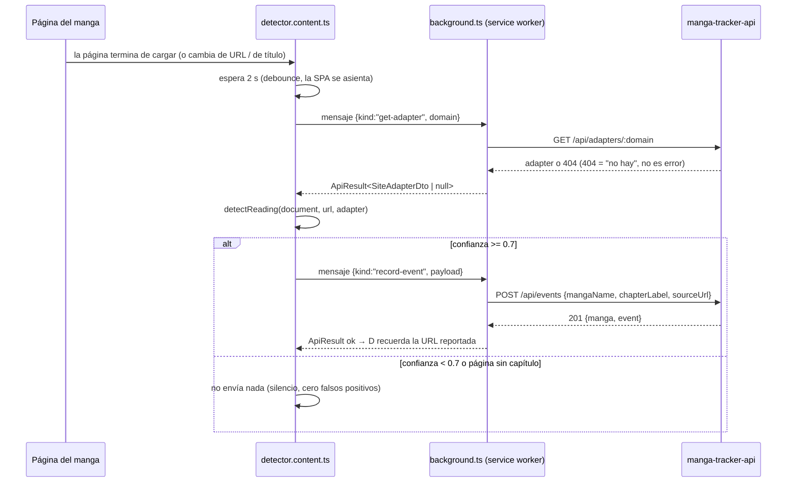

# Cómo se construyó manga-tracker-extension

Crónica completa de la construcción de la extensión, paso a paso y en el **orden real** en
que ocurrió (la columna vertebral es el historial de git: `git log --oneline --reverse`).
Para cada paso: qué se hizo, con qué comando, por qué en ese momento y no en otro, qué
archivos y funciones aparecieron, y qué hace cada función. Al final hay un recetario con
los pasos generalizables para repetir este proceso en otro proyecto.

> **Nota previa sobre "clases":** este código no tiene clases propias. Es el estilo
> idiomático de TypeScript moderno con WXT: módulos que exportan **funciones puras**,
> **tipos** y **constantes**. Las únicas "clases" que se usan vienen de las plataformas
> (`URL`, `Response`, `MutationObserver`, `RegExp`) o de React. El recorrido va
> **archivo por archivo, función por función** — el equivalente exacto de "clase por
> clase, método por método" en este diseño.

---

## 0. Visión general: qué es esta extensión y cómo encajan las piezas

Extensión de navegador **Manifest V3** (el formato actual de Chrome/Brave). Su único
trabajo: detectar qué manga y qué capítulo estás leyendo en un sitio que vos elegiste
trackear, y avisarle a `manga-tracker-api` (el backend local, en `http://localhost` y el
puerto donde se haya instalado — 5150 por defecto).

Una extensión MV3 tiene tres tipos de piezas, y acá están las tres:

- **Service worker** (`entrypoints/background.ts`): un proceso sin UI que vive en el
  navegador. Acá es **el único que habla HTTP con el backend**. Todo lo demás le manda
  mensajes.
- **Content scripts** (`entrypoints/content.ts` y `entrypoints/detector.content.ts`):
  código que se inyecta DENTRO de la página del manga y puede leer su DOM. No hablan HTTP
  directo: le piden todo al service worker por mensajes.
- **Popup** (`entrypoints/popup/`): la ventanita React que se abre al clickear el ícono.
  Muestra estado y tiene los botones de "Trackear este sitio".

El flujo completo de una lectura automática:



El orden de construcción fue de afuera hacia adentro: primero la **infraestructura**
(scaffold, tooling, identidad), después el **contrato** con el API, después el **canal de
mensajes**, y recién entonces las **features** (detección, tracking). Cada fix posterior
nació de un síntoma real usando la extensión de verdad.

---

## 1. Paso 1 — Elegir framework y scaffold (commit `d69e857`)

### La decisión previa (antes de escribir un solo comando)

El plan original (PLAN.md del API) pineaba CRXJS. Antes de obedecerlo a ciegas se
re-evaluó el ecosistema **a la fecha real de construcción** (jul 2026), comparando tres
candidatos con estos criterios: ¿tiene CLI para scaffoldear?, ¿genera el manifest o hay
que escribirlo a mano?, ¿tiene HMR?, ¿soporta Bun?

- **WXT**: CLI con soporte Bun nativo, manifest generado desde `wxt.config.ts`,
  entrypoints por archivo (convención sobre configuración), HMR. ✅ elegido.
- **CRXJS**: exige scaffolding vía npm y manifest manual.
- **Plasmo**: en modo mantenimiento (señal de riesgo a futuro).

Lección: un plan escrito hace meses pinea versiones/herramientas que hay que re-validar
cuando llega el momento de usarlas. El cambio se propuso, se aprobó, y se documentó en el
PLAN.md del API (que es el roadmap compartido de los tres repos).

### El comando y qué generó

```bash
cd ~/Documents/Git
bunx wxt@latest init manga-tracker-extension -t react --pm bun
cd manga-tracker-extension && bun install
```

El template `react` de WXT genera:

- `wxt.config.ts` — la configuración central; el manifest NO se escribe a mano, se
  declara acá y WXT lo genera en `.output/<target>/manifest.json` en cada build.
- `entrypoints/` — cada archivo de esta carpeta se convierte en una pieza de la
  extensión según su nombre: `background.ts` → service worker, `*.content.ts` → content
  script, `popup/` → popup. No hay routing manual.
- `.wxt/` — tipos TypeScript **generados** por `wxt prepare` (corre en `postinstall`).
  Nunca se edita; está gitignorado. Importante: si agregás un entrypoint nuevo, hay que
  correr `bunx wxt prepare` para regenerar tipos como `ScriptPublicPath` (nos pasó: un
  path de content script nuevo daba error TS2820 hasta regenerar).
- `public/icon/*.png` — íconos en los 5 tamaños que pide Chrome.

El primer commit es SOLO el template, sin tocar nada: así cualquier `git diff` posterior
muestra exactamente qué es nuestro y qué era del template.

---

## 2. Paso 2 — Tooling espejo del API (commit `28548c6`)

**Por qué esto va antes que cualquier lógica:** los tres repos del sistema comparten los
mismos gates de calidad (`lint` + `typecheck` + `test`). Si los instalás al final, migrás
código ya escrito a reglas nuevas; si los instalás primero, cada línea nace validada.

Qué se configuró, archivo por archivo:

- **`biome.json`** — linter + formatter (Biome reemplaza a ESLint+Prettier con una sola
  herramienta). Config: `vcs.useIgnoreFile: true` (respeta `.gitignore`, así no lintea
  `.output/`), preset `recommended`, `organizeImports` automático.
- **`package.json` → scripts**:
  - `dev` / `build` / `zip`: comandos de WXT (`wxt`, `wxt build`, `wxt zip`).
  - `test`: `vitest run` — **no** `bun test`; el runner es vitest porque WXT provee un
    plugin de testing propio (ver abajo).
  - `lint`: `biome check .` · `format`: `biome check --write .`
  - `typecheck`: `tsc --noEmit` con `typescript@7` (tsgo, el compilador nativo — mismo
    que en el API).
  - `postinstall`: `wxt prepare` — regenera `.wxt/` tras cada install.
- **`vitest.config.ts`** — 6 líneas: registra el plugin `WxtVitest()` de `wxt/testing`.
  Ese plugin hace dos cosas clave: resuelve los alias de WXT (`#imports`, `@/`) dentro de
  los tests, y provee `fakeBrowser` — una implementación en memoria de las APIs
  `browser.*` para testear sin navegador real.
- **`tsconfig.json`** — extiende el generado por WXT en `.wxt/tsconfig.json`.

---

## 3. Paso 3 — Identidad y permisos: el manifest (commit `80787ba`)

**Por qué la identidad fue "lo primero de verdad":** el backend tiene una allowlist de
CORS. Las extensiones tienen un origin `chrome-extension://<id>`, y ese id se **deriva de
la clave pública** del manifest. Sin clave fija, cada máquina/carga genera un id
distinto y habría que tocar el CORS del backend a cada rato. Con clave fija, el id es
estable para siempre y se agrega al backend **una sola vez** (se hizo en el mismo día:
commit `3edfacd` del API).

Cómo se generó la identidad:

```bash
# 1. Clave privada RSA (queda FUERA de git — está en .gitignore como *.pem)
openssl genrsa -out extension-key.pem 2048
# 2. Clave pública en DER + base64 → va en el campo "key" del manifest
openssl rsa -in extension-key.pem -pubout -outform DER | base64
# 3. El id resultante: sha256 de la pubkey DER, primeros 16 bytes, mapeados a letras a-p
#    → cfjiinlnepkmlaafdclmlpjbmpofplop (verificado contra chrome://extensions)
```

`wxt.config.ts` quedó así, campo por campo:

- `modules: ["@wxt-dev/module-react"]` — habilita React en el popup.
- `manifest.name: "Manga Tracker"` — nombre visible.
- `manifest.key` — la clave pública de arriba (con comentario explicando el porqué).
- `manifest.permissions: ["storage", "activeTab", "scripting"]` — lo MÍNIMO:
  - `activeTab`: acceso temporal a la pestaña activa cuando el usuario interactúa.
  - `scripting`: poder inyectar/registrar content scripts por código.
  - `storage`: almacenamiento de la extensión.
- `manifest.host_permissions: ["http://localhost/*"]` — el ÚNICO host fijo es el backend
  local. Sin esto, el `fetch` del service worker al backend fallaría. **Sin puerto a
  propósito**: un match pattern sin puerto coincide con *todos* los puertos, que es lo que
  necesita el descubrimiento (paso 4) — una copia instalada escucha donde haya lugar. Sigue
  siendo sólo localhost: no concede absolutamente nada en internet.
- `manifest.optional_host_permissions: ["https://*/*", "http://*/*"]` — los sitios de
  manga NO se piden al instalar: se piden **en runtime, sitio por sitio**, cuando el
  usuario aprieta "Trackear este sitio". Filosofía opt-in: la extensión no puede leer
  ninguna página que no hayas autorizado explícitamente.

Verificación manual de este paso (la hizo el usuario): cargar `.output/chrome-mv3-dev/`
como "extensión sin empaquetar" en Brave y Chrome y confirmar que el id coincidía en
ambos.

---

## 4. Paso 4 — La primera pieza de código: el contrato con el API

**Por qué se empezó por acá** (la respuesta a "¿con qué clase comenzaste?"): todo lo que
hace la extensión termina en una llamada al backend. Si el contrato (tipos + cliente
HTTP) existe primero, cada capa siguiente se escribe contra tipos reales y el compilador
te avisa de inconsistencias al instante. Es la misma razón por la que en el API se
escribió primero el schema de Prisma.

### `utils/api/types.ts` — los DTOs

Interfaces **duplicadas a mano** desde los schemas Zod del API (`src/lib/schemas.ts` y
las rutas): `MangaDto`, `ReadingEventDto`, `CreateEventBody` (lo único que la extensión
envía: `{mangaName, chapterLabel, sourceUrl}` — el servidor deriva slug, dominio y número
de capítulo; **nunca se confía en el cliente para eso**), `CreateEventResponse`,
`SiteAdapterDto`, `HealthResponse`, `ErrorResponse`.

Regla de contrato (constraint del proyecto, sin monorepo ni paquete compartido): si un
contrato cambia en el API, este archivo cambia **en el mismo commit** conceptual del
lado de la extensión.

### `utils/api/client.ts` — el cliente HTTP

- La URL base **ya no es una constante**: la resuelve `utils/api/discovery.ts`. Serlo valía
  mientras el puerto se elegía una vez y se anotaba; una copia instalada escucha en el puerto
  que estuviera libre en esa máquina, así que hay que *buscar* el backend en vez de suponerlo.
  La búsqueda está acotada por un contrato con el instalador — **puertos 5150-5159** — y un
  candidato sólo cuenta si `GET /health` responde `service: "manga-tracker-api"`. Sin ese
  nombre, cualquier otra cosa que devuelva 200 en un puerto de loopback podría terminar
  recibiendo tus lecturas.
  - El resultado se cachea en `storage.session`: el service worker de MV3 se apaga a los
    segundos de inactividad, así que un caché en memoria se perdería entre dos capítulos; y
    como no sobrevive al cierre del navegador, un puerto cambiado por una reinstalación se
    redescubre solo.
  - Si un pedido no llega a ningún servidor, se olvida el caché, se busca de nuevo y se
    reintenta **una** vez. Sólo en ese caso: si el backend respondió —aunque sea un 500— esa
    es la respuesta, y reintentarla en otro puerto podría registrar el capítulo dos veces.
- `type ApiResult<T> = { ok: true; data: T } | { ok: false; error: string; status?: number }`
  — **la decisión de diseño más importante del archivo**: las funciones NUNCA lanzan
  excepciones; devuelven una unión discriminada. Quien llama está obligado por el
  compilador a chequear `result.ok` antes de tocar `result.data`. Los errores no pueden
  "olvidarse".
- `request<T>(path, init?)` (interna) — hace el `fetch` contra `API_BASE_URL + path`,
  con tres niveles de manejo: (1) el `fetch` mismo falla (red) → `{ok:false, error}`;
  (2) el body no es JSON → se ignora y decide el status; (3) status no-2xx →
  `{ok:false, error, status}` extrayendo el mensaje del body si tiene forma
  `{error: string}`. El cast `body as T` lleva un comentario justificándolo: el schema
  OpenAPI del API es el contrato y esta es la frontera de confianza.
- `extractErrorMessage(body, status)` (interna) — narrowing de `unknown`: si el body es
  un objeto con `error: string` lo usa; si no, `"HTTP <status>"`.
- `pingHealth()` — `GET /health`; la usa el popup para el semáforo de conexión.
- `createReadingEvent(body)` — `POST /api/events`; el único write.
- `getAdapter(domain)` — `GET /api/adapters/:domain` con un detalle de diseño: si el API
  responde 404, lo **convierte en `{ok:true, data:null}`** porque "este sitio no tiene
  adapter calibrado" es un resultado normal del dominio, no un error.

Test colocado (`client.test.ts`): mockea `fetch` global y verifica URLs llamadas, mapeo
de errores con status, fallos de red, y la conversión 404→null.

---

## 5. Paso 5 — Mensajería tipada y handshake end-to-end (commit `d253f6a`)

En MV3, popup y content scripts hablan con el service worker por
`browser.runtime.sendMessage` — un canal **sin tipos** (viaja `any`). Este paso construyó
un protocolo tipado encima, y lo probó end-to-end con un botón de evento test.

### `utils/messages.ts` — el protocolo

- `type RuntimeMessage` — unión discriminada por `kind` con los seis mensajes del
  sistema: `ping`, `send-test-event {tabId}`, `get-adapter {domain}`,
  `record-event {payload}`, `register-site {originPattern, tabId}`,
  `unregister-site {originPattern}`.
- `interface MessageResponses` — mapa `kind → tipo de respuesta` (p. ej. `"ping"` →
  `ApiResult<HealthResponse>`). Es lo que permite que la respuesta esté tipada según el
  mensaje enviado.
- `isRuntimeMessage(value)` — **type guard** en runtime: como cualquier página/extensión
  puede mandar mensajes arbitrarios, el service worker valida la forma antes de actuar.
  Un `switch` sobre `value.kind` verifica los campos de cada variante.
- `isCreateEventBody(value)` (interna) — guard del payload anidado de `record-event`.
- `sendRuntimeMessage<M>(message)` — wrapper de `browser.runtime.sendMessage` que
  devuelve `Promise<MessageResponses[M["kind"]]>`: el que envía `{kind:"ping"}` recibe,
  tipado, un `ApiResult<HealthResponse>`. El único `as` del archivo está justificado en
  comentario (el canal nativo es untyped; este módulo ES el contrato en ambos extremos).

### `utils/message-handler.ts` — la lógica del service worker

- `handleMessage(message)` — un `switch` exhaustivo sobre `message.kind` que rutea cada
  mensaje a su función (`pingHealth`, `getAdapter`, `createReadingEvent`,
  `registerSite`, `unregisterSite`, `sendTestEvent`). Como `RuntimeMessage` es una unión
  discriminada, si mañana se agrega un `kind` nuevo y no se maneja, **el compilador
  falla** (el switch deja de ser exhaustivo).
- `sendTestEvent(tabId)` (interna) — inyecta el content script de página en la pestaña,
  toma `{title, url}` reales y los envía como evento con `buildTestEventPayload`.
- `collectPageInfo(tabId)` (interna) — `browser.scripting.executeScript({target, files:
  ["/content-scripts/content.js"]})`; el resultado de `main()` del content script viaja
  como `injection.result`, que se valida con `isPageInfo` (es `unknown` hasta probar lo
  contrario).

**Lección importante (por qué este archivo existe separado del entrypoint):** el plan
era poner esta lógica directo en `background.ts`. Pero al testear con `fakeBrowser`
descubrimos que el fake **no soporta el protocolo nativo de Chrome** (`sendResponse` +
`return true`); solo el estilo promesa. En Chrome real el protocolo nativo es el
correcto. Solución: el entrypoint conserva el protocolo nativo y la lógica vive en
`handleMessage`, que se testea directo sin pasar por el canal. Es el mismo split
rutas/servicio del API: **entrypoints finos, lógica testeable en `utils/`**.

### `entrypoints/background.ts` — el wiring

`defineBackground` registra el listener de mensajes: valida con `isRuntimeMessage`
(mensaje desconocido → `return false`, no responde), llama `handleMessage(message)
.then(sendResponse)` y **`return true`** — ese `true` le dice a Chrome "la respuesta
llega async, mantené el canal abierto". Sin él, el canal se cierra antes de que el
`fetch` termine. (Las dos líneas de re-sync que también viven acá llegaron en el paso 9.)

### `entrypoints/content.ts` — la sonda de página

Content script con `registration: "runtime"`: NO va en el manifest ni se inyecta solo;
solo existe cuando el service worker lo inyecta con `executeScript` (posible gracias a
`activeTab` + `scripting`, sin permisos de host). Su `main()` devuelve
`{title: document.title, url: location.href}` — y ese return se convierte en el
resultado de `executeScript`. Soporte: `utils/page-info.ts` (`PageInfo` + guard
`isPageInfo`) y `utils/test-event.ts` (`buildTestEventPayload(page)`: título real de la
pestaña como `mangaName`, `"Cap. 0 (evento test)"` como label reconocible).

### `entrypoints/popup/` — la ventanita

React montado en `main.tsx` → `App.tsx` (el shell HTML es `index.html`; estilos en
`style.css` global y `App.css` del componente). Todo el estado del popup se modela con
**uniones discriminadas** (regla del repo: nada de combinaciones de booleans):

- `ConnectionState`: `checking | connected | disconnected{error}` — semáforo que se
  resuelve con `sendRuntimeMessage({kind:"ping"})` al montar.
- `TestEventState`: `idle | sending | sent{data} | failed{error}` — ciclo del botón
  "Enviar evento test".
- `SiteState`: `loading | untrackable | untracked{host, originPattern, tabId} |
  tracked{...} | error{error}` — estado del sitio de la pestaña activa (llegó en el
  paso 7, pero vive acá).

Funciones del popup: `readActiveSite()` (lee la pestaña activa con
`browser.tabs.query`, valida que sea http/https, arma el `originPattern`
(`https://sitio.com/*`) y consulta `browser.permissions.contains` para saber si ya está
trackeado); `enableTracking(current)` (pide el permiso con
`browser.permissions.request` — **debe ocurrir en el popup porque requiere gesto del
usuario** — y recién después manda `register-site` al background);
`disableTracking(current)` (manda `unregister-site` y devuelve el permiso con
`permissions.remove`); `sendTestEvent()`. Componentes de render: `ConnectionBadge`,
`SiteSection`, `TestEventResult` — cada uno un `switch` sobre su unión.

**Verificación end-to-end de este paso** (con el usuario): popup "Conectado" en Brave y
Chrome, botón de evento test → fila real en SQLite vía `GET /api/library`. Fue el
"hola mundo" del sistema completo. Errores reales encontrados en el camino: intentar el
evento test sobre una pestaña `chrome://` (no inyectable — por eso `readActiveSite`
valida el protocolo).

---

## 6. Paso 6 — El pipeline de detección (commit `d3bd50e`)

Con el canal probado, la primera feature real: mirar una página y decidir "¿esto es un
capítulo de manga? ¿cuál?". Diseño clave: **todo el pipeline es puro** (funciones que
reciben datos y devuelven datos, sin `browser.*`, sin fetch) para poder testearlo
exhaustivamente con happy-dom. La E/S queda en los bordes.

### `utils/detection/page-signals.ts` — leer el DOM una sola vez

- `interface PageSignals` — `{url, documentTitle, ogTitle, twitterTitle, firstHeading}`.
  Todo lo downstream trabaja sobre esta estructura plana; el DOM se toca solo acá.
- `collectPageSignals(doc, url)` — la arma leyendo `doc.title`, los `<meta>` y el primer
  `<h1>` con texto.
- `metaContent(doc, selector)` (interna) — texto de `meta[property="og:title"]` /
  `meta[name="twitter:title"]`, con trim, `null` si no está.
- `firstHeadingText(doc)` (interna) — recorre los `h1` y devuelve el primero no vacío.

### `utils/detection/heuristics.ts` — el cerebro (sin adapter)

Constantes que definen el comportamiento:

- `CONFIDENCE_THRESHOLD = 0.7` — exportada; debajo de esto NO se envía nada (la
  calibración manual de la Fase 7 cubrirá esos casos). Preferimos perder un evento antes
  que guardar basura.
- Los puntos de confianza se suman en **centésimas enteras** y se dividen por 100 al
  final: `CHAPTER_BASE_CONFIDENCE = 45`, `TITLE_CHAPTER_BONUS = 10`,
  `TITLE_CONFIDENCE = {og: 35, twitter: 30, heading: 25, "document-title": 20}`.
  ¿Por qué enteros? Sumar floats (0.45+0.35+0.1) produce ruido binario
  (0.9000000000000001) que rompe asserts de tests; con enteros la suma es exacta.
- `CHAPTER_URL_PATTERNS` — regexes de capítulo en URL: `/cap(itulo)?[/-]N`,
  `/chapter[/-]N`, `/ch[/-]N`, `/c/N`, con decimales `.` o `,`.
- `READER_PATH_PATTERN` — `^/(?:leer|lector|read|reader|ver|viewer)(?:_\w+)?/` (llegó en
  el paso 10.4; se explica ahí).
- `CHAPTER_WORDS` — `(?:cap[íi]tulo|chapter|cap\.?|ch\.?)`, con las alternativas largas
  primero para que "capítulo" no se matchee a medias como "cap".

Funciones:

- `detectFromHeuristics(signals): Detection` — el orquestador. `Detection` es otra unión
  discriminada: `{detected:true, mangaName, chapterLabel, confidence}` o
  `{detected:false, reason}` con razones precisas (`no-chapter-in-url`, `no-title`,
  `no-chapter-in-title`) que hacen el debugging trivial. Lógica: (1) gate de URL — si la
  URL no tiene patrón de capítulo NI es ruta de lector, es un catálogo/home → afuera;
  (2) elegir título con `pickTitle`; (3) el capítulo del título le gana al de la URL;
  (4) limpiar el nombre; (5) calcular confianza.
- `extractChapterFromUrl(url)` — prueba los patrones sobre `pathname` (solo el path: un
  `?q=/chapter-12` en el query no cuenta) y normaliza coma decimal → punto.
- `isReaderPath(url)` — ¿el path arranca con `/leer/`, `/viewer/`, etc.?
- `pathnameOf(url)` (interna) — `new URL(url).pathname` con try/catch → `null` si la URL
  es inválida.
- `extractChapterFromTitle(title)` — `\b` + `CHAPTER_WORDS` + número: "Capítulo 122 de X"
  → `"122"`. El `\b` evita que "Punch 3" cuente como "ch 3".
- `pickTitle(signals)` (interna) — prioridad og > twitter > heading > document-title,
  con un refinamiento del paso 10.4: la primera fuente **que nombre un capítulo** le
  gana a una de mayor prioridad que no lo nombre.
- `cleanMangaName(rawTitle, chapterNumber)` — el nombre debe ser **estable entre
  capítulos** (el API deduplica por slug normalizado del nombre): corta el sufijo de
  sitio tras `|`, y si el fragmento "Capítulo N" tiene texto antes, el nombre es TODO lo
  anterior (lo que sigue es basura del sitio); si está al inicio ("Capítulo N de X"),
  tira el fragmento líder y su conector; limpia separadores sueltos y espacios.

### `utils/detection/adapter.ts` — cuando hay calibración guardada

- `detectFromAdapter(adapter, doc, url)` — un adapter es calibración confirmada por el
  usuario (Fase 7, futura), así que si matchea, `confidence: 1`. Si el selector ya no
  encuentra nada (el sitio cambió su HTML) devuelve `null` y el caller cae a heurística.
- `selectorText(doc, selector)` / `chapterFromRegex(regex, url)` (internas) — ambas con
  try/catch: un selector o regex **inválido guardado en la DB** no puede tirar el
  pipeline; se trata como "no matcheó".

### `utils/detection/detect.ts` — la puerta de entrada

- `detectReading(doc, url, adapter)` — 12 líneas: adapter primero (si hay y matchea),
  heurística como fallback. Es lo único que llama el content script.

Tests colocados de todo el pipeline (los de DOM con `// @vitest-environment happy-dom`).
Detalle aprendido con happy-dom: si seteás `document.title` y DESPUÉS reemplazás
`head.innerHTML`, el título se pierde — el orden en el fixture importa.

---

## 7. Paso 7 — Tracking automático opt-in por sitio (commit `96034bf`)

La pieza que une todo: "quiero que ESTE sitio se trackee solo". Diseño en dos mitades:

### `utils/site-registration.ts` — registrar el detector por origen

Constantes: `DETECTOR_SCRIPT = "/content-scripts/detector.js"` (la barra inicial es
obligatoria — tipo `ScriptPublicPath` de `.wxt/`) y `DETECTOR_ID_PREFIX = "detector:"`.

El permiso del backend **no** es un sitio trackeado y hay que excluirlo de la lista de
orígenes: registrarle el detector significaría que la extensión intenta trackear al propio
dashboard. Antes era una comparación contra la cadena exacta `"http://localhost:5150/*"`, y
eso se rompió solo al volverse configurable el puerto: el manifest pasó a pedir
`http://localhost/*`, la comparación dejó de coincidir y localhost habría entrado como sitio
de manga. Ahora es un predicado, `isBackendOrigin(origin)`, que reconoce las dos formas —
también la vieja, que puede seguir concedida en un navegador que venía de la versión
anterior. Cada una tiene su test.

- `scriptId(originPattern)` (interna) — `"detector:" + originPattern`: el id del
  registro codifica a qué origen pertenece, lo que después permite la re-sincronización.
- `detectorRegistration(originPattern)` (interna) — arma el objeto de registro:
  `{id, matches:[origin], js:[DETECTOR_SCRIPT], runAt:"document_idle",
  persistAcrossSessions:true}`. Su tipo se deriva con
  `Parameters<typeof browser.scripting.registerContentScripts>[0][number]` (lección: un
  `as const` acá produce arrays readonly incompatibles con la API).
- `registerSite(originPattern, tabId)` — si no existe el registro, lo crea con
  `browser.scripting.registerContentScripts`; además inyecta el detector **ya mismo** en
  la pestaña actual con `executeScript` (sin esperar una recarga). Devuelve
  `ApiResult<null>` (mismo patrón de errores del cliente HTTP).
- `unregisterSite(originPattern)` — quita el registro si existe (no-op si no).
- `syncRegisteredSites()` — llegó en el paso 9; explicada ahí.

### `entrypoints/detector.content.ts` — el detector en la página

`registration: "runtime"` (fuera del manifest; solo existe en orígenes registrados).
Dentro de `main(ctx)`:

- Guard `window.__mangaTrackerDetectorLoaded` — evita doble ejecución cuando coinciden
  el registro y el `executeScript` inmediato de `registerSite`.
- `SETTLE_DELAY_MS = 2000` — las SPA cargan contenido después del load; se espera 2 s.
- `detectAndReport()` — el corazón: si la URL ya fue reportada (`lastReportedUrl`),
  corta; pide el adapter al background (`get-adapter`); corre
  `detectReading(document, url, adapter)`; si `detected` y
  `confidence >= CONFIDENCE_THRESHOLD`, manda `record-event`; solo si el envío fue `ok`
  marca `lastReportedUrl = url` (si falló, el próximo intento reintenta).
- `scheduleDetection()` — debounce: `clearTimeout` + `ctx.setTimeout(detectAndReport,
  2000)`. Usar `ctx.setTimeout` (de WXT) en vez de `setTimeout` hace que el timer muera
  si la extensión se invalida.
- Disparadores: al cargar; `ctx.addEventListener(window, "wxt:locationchange", ...)` —
  evento de WXT que cubre pushState/replaceState/popstate de las SPA (Fase 8 del plan
  resuelta con una línea); y el observer de título del paso 10.4.

### El circuito opt-in completo

Popup: botón "Trackear este sitio" → `browser.permissions.request({origins})` (gesto de
usuario, obligatorio) → mensaje `register-site` → background registra el detector para
ese origen y lo inyecta en la pestaña. Desde ahí, cada visita a ese sitio corre el
detector automáticamente. "Dejar de trackear" desanda todo.

---

## 8. Paso 8 — Fix: nombres sucios (commit `2379582`)

**Síntoma real:** el primer manga auto-guardado quedó como
"Capítulo 32 de Mi Invocación es de Clase EX | Olympus Scanlation" en vez de
"Mi Invocación es de Clase EX".

**Diagnóstico:** el og:title de Olympus tiene el formato "Capítulo N de <nombre> |
<sitio>", y `cleanMangaName` de entonces solo quitaba el fragmento "Capítulo N" en
cualquier posición, dejando el "de" líder y el sufijo.

**Fix:** la regla del fragmento líder en `cleanMangaName` (regex anclada a `^` que
además consume el conector `de|del|of` y separadores). Test con el título real del
sitio. Además, limpieza a mano de la fila basura en la DB de producción (con
autorización del usuario; `sqlite3`, borrando eventos antes que mangas por la FK).

---

## 9. Paso 9 — Fix: capítulo 130729 (commit `890ca32`) y el reload que rompía todo (commit `5ebe57b`)

### 9a. El título le gana a la URL

**Síntoma real:** leyendo el capítulo **122**, se guardó "Cap. 130729".

**Diagnóstico:** la URL de Olympus es `/capitulo/130729/` — ese número es un **id
interno**, no el capítulo. El capítulo real estaba en el og:title ("Capítulo 122 de...").

**Fix:** en `detectFromHeuristics`, el número de la URL pasó a ser solo el **gate**
("esto es una página de capítulo") y candidato de reserva;
`extractChapterFromTitle(title) ?? urlChapter` — si el título nombra un capítulo, gana.
Tests con el caso real.

### 9b. Chrome borra los registros al recargar la extensión

**Síntoma real:** tras apretar ⟳ en `chrome://extensions`, ningún manga se guardaba más,
aunque el popup decía "tracking activo".

**Diagnóstico** (contra la documentación de Chrome): los content scripts registrados con
`scripting.registerContentScripts` + `persistAcrossSessions: true` sobreviven reinicios
del **navegador**, pero se **borran al recargar/actualizar la extensión**. El permiso de
host sí sobrevive — por eso el popup (que solo mira `permissions.contains`) mentía.

**Fix:** `syncRegisteredSites()` en `site-registration.ts` — reconciliación en ambas
direcciones: lee `browser.permissions.getAll()` (verdad sobre lo autorizado) y
`getRegisteredContentScripts()` (verdad sobre lo registrado); registra los orígenes
concedidos sin registro (excluyendo `BACKEND_ORIGIN_PATTERN`) y des-registra los ids
`detector:*` cuyo permiso fue revocado. El background la ejecuta en
`browser.runtime.onInstalled` (cubre el reload — este era el bug) y
`browser.runtime.onStartup` (defensivo; en Firefox los registros tampoco persisten entre
sesiones), vía `resyncDetectors()` que loguea si la sync falla. Cinco tests nuevos
stubeando `scripting`/`permissions` sobre `fakeBrowser` (casts `as unknown as typeof`
con comentario: el fake no implementa esos namespaces).

---

## 10. Paso 10 — Fix: sitios SPA sin capítulo en la URL (commit `0a480c6`)

**Síntoma real:** manhwaweb.com trackeado, capítulo abierto, nada guardado; Olympus
seguía funcionando.

**Diagnóstico (el más interesante del proyecto — se investigó el sitio real):**

1. `curl` a la página → HTML shell de Vite/React **vacío** (`<div id="root">`), título
   genérico, sin og:title ni h1. Todo se renderiza client-side.
2. La URL (`/leer/<slug>_1750256573107-36_01`) no matchea ningún patrón de capítulo →
   la detección moría en `no-chapter-in-url` sin mirar nada más.
3. Descargando el **bundle JS del sitio** y grepeándolo se encontró la plantilla:
   `document.title = \`${name} Capitulo ${chapter} manhwa - ManhwaWeb\`` — el capítulo
   SOLO existe en `document.title`, y recién cuando la SPA termina de cargar datos.
4. Tres bloqueos encadenados: el gate de URL lo descartaba; aunque pasara, document-title
   solo daba 0.45+0.20 = 0.65 < 0.7; y el título correcto podía llegar DESPUÉS de los
   2 s del detector.

**Fix, pieza por pieza:**

- `isReaderPath` + gate de dos niveles: las rutas de lector pasan el gate **solo si el
  título nombra un capítulo explícito** (los números de esas URLs son ids internos y
  jamás se usan como capítulo → razón nueva `no-chapter-in-title`). Los catálogos siguen
  bloqueados.
- `TITLE_CHAPTER_BONUS = 10`: un título que dice "Capitulo N" es evidencia fuerte, venga
  de donde venga → manhwaweb queda en 0.75 ≥ 0.7 y se envía.
- `pickTitle` prefiere la fuente con capítulo (un `h1` de logo ya no tapa al
  document.title útil).
- `cleanMangaName` con regla de prefijo (el nombre es lo anterior al fragmento;
  " manhwa - ManhwaWeb" muere) y `\b` en el fragmento (bug latente "Punch 3" → "Pun").
- `MutationObserver` sobre `document.head` en el detector: cuando `document.title`
  cambia de verdad (se compara contra `lastSeenTitle`), se re-agenda la detección. Se
  desconecta en `ctx.onInvalidated`.

Tests con la URL y el título reales de manhwaweb. Verificado por el usuario en el sitio
real ("funciono perfecto").

---

## 11. Paso 11 — Diagnóstico visible, guard de ids gigantes y calibración por 2 clicks (commits `ba17cba` y `da5df2a`)

**Síntomas reales que dispararon esta ronda:** (1) capítulos duplicados en la biblioteca
— causa doble: el LaunchAgent del API nunca se había reiniciado (el fix anterior jamás
corrió en producción) y la regla de dedup era por ventana de tiempo cuando el producto
pedía "un capítulo ya registrado no se guarda nunca más" (eso se arregló en el API:
ahora `POST /api/events` devuelve el evento existente si el capítulo ya está en la
historia del manga); (2) un sitio nuevo (viralikigai/Ikigai) no guardó nada y la
extensión **falló en silencio** — imposible saber por qué sin debuggear.

### 11a. Guard de ids gigantes (`utils/detection/heuristics.ts`)

Al investigar Ikigai: su URL es `/capitulo/1187745088806715393/` — pasa el gate de
capítulo con un número que claramente es un id interno. Si el título no nombrara el
capítulo, se habría guardado "Cap. 1187745088806715393" (la clase de bug del 130729).
Regla genérica nueva: `MAX_URL_CHAPTER_DIGITS = 4` + `isPlausibleChapter(chapter)`
(interna): un número de URL con más de 4 dígitos enteros sigue abriendo el gate ("esto
es una página de capítulo") pero **jamás** se usa como número — sin confirmación del
título, `no-chapter-in-title` y silencio. Ningún manga real supera los 4 dígitos.

### 11b. Diagnóstico por pestaña (la respuesta a "no quiero mandarte URLs")

- `utils/detection-log.ts` — `Map<tabId, {url, detection}>` en memoria del service
  worker: `recordDetection`, `getDetection`, `clearTab` (el background la limpia en
  `tabs.onRemoved`). En memoria a propósito: si Chrome mata el worker, el popup dice
  "sin detección aún", que es exacto.
- Mensajes nuevos en `utils/messages.ts`: `report-detection {url, detection}` (el
  detector lo envía tras CADA corrida, detecte o no; el background saca el tabId de
  `sender.tab.id` — `handleMessage` ganó el parámetro `senderTabId`) y
  `get-detection {tabId}` (el popup pregunta). Guards nuevos: `isDetection`,
  `isCreateAdapterBody`, más `ContentCommand`/`isContentCommand` para el canal inverso
  background→content (`browser.tabs.sendMessage`).
- Popup: componente `DetectionStatus` + `describeDetection(entry)` — traduce el
  resultado a humano: "Detectado: X — Cap. N (75 %)", "La URL no parece de un capítulo",
  "El título no nombra el capítulo → usá Calibrar detección", etc. El detector además
  hace `console.debug("[manga-tracker] detection", …)` en la consola del sitio.

### 11c. Fase 7: overlay de calibración (2 clicks → adapter para siempre)

La garantía de universalidad: cuando la heurística no puede con un sitio, el usuario lo
calibra UNA vez y queda un `SiteAdapter` guardado (los adapters ya tenían prioridad en
`detectReading` con confianza 1 desde el paso 6 — esta pieza es quien los crea).

Flujo completo: popup → botón **"Calibrar detección"** → `start-calibration {tabId}` →
el background inyecta `/content-scripts/calibration.js` → overlay sobre la página →
click en el título → click en el capítulo → confirmar → `save-adapter` → el background
hace `POST /api/adapters` (upsert por dominio) y manda `{kind:"detect-now"}` a la
pestaña → el detector re-corre con el adapter fresco y el capítulo se registra al
instante.

Piezas, función por función:

- `utils/calibration.ts` — `pickElement(element, doc)`: toma el elemento clickeado,
  exige texto no vacío, genera el selector con `finder` de **@medv/finder** (dep nueva;
  genera el selector CSS único más corto) y lo valida **round-trip**: el selector debe
  re-encontrar exactamente ese elemento (`doc.querySelector(selector) === element`);
  si no, `null` y se sigue eligiendo. Sin esa validación, un selector ambiguo trackearía
  silenciosamente el texto equivocado en visitas futuras.
- `entrypoints/calibration.content/index.tsx` — entrypoint `registration: "runtime"` +
  `cssInjectionMode: "ui"`; monta la UI con `createShadowRootUi(ctx, {name:
  "manga-tracker-calibration", position: "modal", zIndex: 2147483647, onMount,
  onRemove})` de WXT: **Shadow DOM** = los estilos del sitio y los nuestros no se
  contaminan. Guard `window.__mangaTrackerCalibrationActive` (se limpia al cerrar, a
  diferencia del detector: la calibración puede relanzarse).
- `entrypoints/calibration.content/CalibrationApp.tsx` — máquina de estados
  `pick-title → pick-chapter → confirm → saving → saved | error` (unión discriminada).
  Mientras se elige: listeners a nivel `document` en **fase capture** — `mouseover`
  resalta el elemento bajo el mouse (outline inline, restaurando el valor previo) y
  `click` hace `preventDefault/stopPropagation` (la página no navega) y llama
  `pickElement`. Los eventos del propio overlay se filtran porque el Shadow DOM los
  retargetea al host (`target.closest("manga-tracker-calibration")`). Escape cancela.
- `entrypoints/calibration.content/style.css` — el truco de puntería: el backdrop cubre
  todo el viewport con `pointer-events: none` (los clicks ATRAVIESAN hacia la página,
  donde los captura el listener) y solo la barra de instrucciones tiene
  `pointer-events: auto`.
- Cliente: `createAdapter(body)` en `utils/api/client.ts` + `CreateAdapterBody` en
  types (contrato copiado de `adapters.routes.ts` del API). Handler: ramas
  `start-calibration` (inyecta el script) y `save-adapter` (guarda y dispara
  `detect-now`). El detector ganó un listener mínimo: ante `detect-now` resetea
  `lastReportedUrl` y re-agenda.

Lección recurrente confirmada una vez más: al crear el entrypoint nuevo, el path
`"/content-scripts/calibration.js"` dio TS2820 hasta correr `bunx wxt prepare`
(regenera el tipo `ScriptPublicPath`).

**Bug descubierto en producción (y su moraleja): el overlay nunca funcionó en ningún
sitio.** El usuario reportó "le di a calibrar y no salió nada". Diagnóstico sobre el
manifest GENERADO (`.output/chrome-mv3/manifest.json`): WXT emitió
`web_accessible_resources: [{resources: ["content-scripts/calibration.css"],
matches: []}]` — con `registration: "runtime"` WXT no sabe en qué sitios correrá el
script, así que declara el CSS con **matches vacío**, y matches vacío significa que
NINGÚN sitio puede fetchear ese recurso. `createShadowRootUi` con `cssInjectionMode:
"ui"` necesita descargar ese CSS para inyectarlo en el Shadow DOM: el fetch fallaba,
la promesa rechazaba y el overlay moría **en silencio** (la extensión carga normal,
Chrome no se queja de un array vacío). Doble fix: (1) declarar la entrada a mano en
`wxt.config.ts` → `manifest.web_accessible_resources` con `matches: ["http://*/*",
"https://*/*"]` (WXT añade igual su entrada vacía; Chrome toma la UNIÓN de las
entradas, así que la nuestra es la que da acceso); (2) envolver el mount del
entrypoint en try/catch con `console.error("[manga-tracker] calibration overlay
failed", cause)` y reset del guard — un fallo de esta clase no puede volver a ser
invisible. Moraleja: **verificar siempre el manifest generado, no el config**; y todo
camino de UI que pueda fallar async necesita un catch que lo cuente.

### 11d. Portadas para el dashboard (agregado posterior)

`coverFromDocument(doc)` en `page-signals.ts`: lee `og:image` (fallback
`twitter:image`), lo resuelve contra `doc.baseURI` (cubre URLs relativas) y solo
acepta esquemas http(s). El detector lo adjunta como `coverUrl` opcional del
`record-event` y el backend lo persiste en el manga — así el dashboard muestra
portadas sin scraping extra: la extensión ya estaba parada en la página.

Refinamiento por un caso real: Olympus declara su LOGO (`/olympus-logo-180.webp`)
como og:image. `coverFromDocument` descarta pathnames con pinta de branding
(`logo|banner|favicon|icon|default|placeholder`) — mejor no mandar nada (el usuario
puede fijar la portada a mano en el dashboard) que llenar la biblioteca de logos.

### 11e. La caza de portada en 3 niveles (`utils/detection/cover-hunt.ts`)

El filtro anterior dejó las portadas en cero: el og:image del capítulo casi nunca es
la portada. Inspeccionando la página REAL de Olympus se encontró la señal utilizable
— y sus trampas: los paneles del capítulo llevan el nombre del manga en su `alt`
(pero miden 4000px de alto), y los links `/series/...` visibles son de mangas
RECOMENDADOS, no del propio. El diseño resultante:

- `nameMatches(name, text)` — solape de palabras significativas del nombre
  (normalizadas, ≥4 letras, exige ≥ mitad): "De duende a Dios Goblin" matchea su
  propia ficha y descarta "secta-de-la-montana".
- `findSeriesLink` — anchors del mismo origen con path de ficha
  (`/series|manga|comics?|.../`) puntuados con `nameMatches` sobre href + texto.
- `coverFromSeriesDocument` — la ficha se descarga con `fetch` same-origin (un
  content script puede), se parsea con `DOMParser` y se toma su og:image (filtrado)
  o la img cuyo alt nombra al manga. Ojo aprendido: el `baseURI` de un documento de
  DOMParser NO es la página descargada — las URLs se resuelven contra la URL de la
  ficha explícitamente.
- `pickCoverFromImages` — último recurso en la propia página: img con alt del manga
  Y dimensiones de portada (`naturalWidth` 80–600, aspecto 1.1–2.0) — los paneles
  quedan fuera por tamaño.
- **Cuándo corre**: el detector manda el evento SIN portada; si la respuesta dice
  `manga.coverUrl === null`, caza y re-envía el mismo evento con `coverUrl` — el
  backend lo dedupea (200) pero persiste la portada (first-wins) y el SSE actualiza
  la tarjeta. Costo: una vez por manga, nunca más.

### 11f. Reinyección en pestañas abiertas (post-reload)

Bug real: tras ⟳, una pestaña de Olympus abierta desde antes dejó de trackear — el
reload invalida los content scripts vivos y los registrados solo se inyectan en
cargas nuevas; "siguiente capítulo" en una SPA no recarga (el Cap. 108 nunca llegó a
la DB). Fix: `injectDetectorIntoOpenTabs()` — tras el re-sync, por cada origen
concedido `browser.tabs.query({url: originPattern})` (los host permissions dan la
visibilidad; no hace falta el permiso "tabs") y `executeScript` del detector en cada
pestaña, con try/catch por pestaña. El guard de doble inyección lo hace idempotente.

### 11g. Nivel 4 de la caza de portadas: la ficha RENDERIZADA (para SPAs)

Caso real que motivó este nivel: los mangas de manhwaweb seguían sin portada aunque
la caza de 3 niveles ya funcionaba en Olympus e Ikigai. La causa es estructural, no
un bug: manhwaweb es una **SPA pura** — la ficha que el nivel 2 descarga con `fetch`
es un shell HTML vacío (el contenido lo pinta JavaScript después), y la página del
capítulo solo tiene paneles (nivel 3 muerto). La portada real SOLO existe en el DOM
**renderizado** de la ficha… que el usuario visita naturalmente al navegar el sitio
para elegir qué leer. De ahí la idea: en vez de scrapear, **esperar a que el usuario
pase por ahí** (nivel oportunista).

El detector ya corre en TODAS las páginas de un sitio trackeado (se registra por
origen, no por path), así que la pieza encaja sin permisos nuevos:

- `isSeriesPath(pathname)` (`cover-hunt.ts`) — expone el `SERIES_PATH_PATTERN` que ya
  usaba `findSeriesLink` (`/series|manga|manhwa|comics?|obra|.../`): distingue una
  ficha de un capítulo (`/leer/...`, `/capitulo/...` no matchean).
- `matchLibraryEntry(entries, pageText)` (`cover-hunt.ts`, pura) — de las entradas de
  la biblioteca **sin portada** (`coverUrl === null`), la de mayor solape de palabras
  significativas contra `document.title + <h1>`; la misma regla "≥ mitad de las
  palabras" de `nameMatches`. Devuelve null si ninguna matchea — en una ficha ajena
  no pasa nada.
- `pickSeriesPageCover(doc, mangaName)` (`cover-hunt.ts`) — sobre el DOM renderizado:
  og:image (filtrado anti-branding) → img cuyo alt/src nombre al manga → **la img
  retrato más grande** (ancho ≥120, aspecto 1.15–2.2, SIN tope superior de ancho).
  El tope de ancho existió en la primera versión (heredado del nivel 3) y costó un
  caso real: la portada hero de "Emperador Mágico" en manhwaweb mide **1472×2364** y
  quedaba excluida por `naturalWidth > 1000` — mientras la del Carnicero (300×440)
  pasaba. Lección: en una FICHA no hay paneles que excluir por tamaño; el
  discriminador correcto es la PROPORCIÓN retrato (los banners son apaisados y las
  tiras de capítulo tienen ratio >2.2), no un tope de píxeles. Tres endurecimientos
  más de esa misma pasada: (1) si `naturalWidth` es 0 (imagen aún descargándose o
  `loading="lazy"`) se usa el box renderizado (`getBoundingClientRect`) — la caja ya
  es retrato antes de que lleguen los bytes y el src ya es usable; (2) la URL sale de
  `currentSrc || getAttribute("src")` (cubre srcset y librerías lazy); (3) el
  name-match por src decodifica percent-encoding (`m%C3%A1gico` cuenta como
  "magico").
- Mensajería nueva: `get-library` → `GET /api/library` y `set-cover {mangaId,
  coverUrl}` → `PUT /api/mangas/:id` (el endpoint que ya existía para la edición
  manual desde el dashboard) — con sus guards en `isRuntimeMessage`, ramas en
  `handleMessage` y `getLibrary()`/`setMangaCover()` en el cliente. `LibraryEntryDto`
  se duplicó a mano en `utils/api/types.ts` (misma regla de siempre: el contrato
  cambia en el API → cambia aquí en el mismo commit).
- Integración (`detector.content.ts`): cuando la detección devuelve
  `no-chapter-in-url` Y `isSeriesPath(location.pathname)` → `captureSeriesCover(url)`:
  **bucle acotado propio** (8 intentos × 1500 ms ≈ 10.5 s) que en cada vuelta pide la
  biblioteca, matchea (`document.title + h1`), extrae y manda `set-cover`. La primera
  versión era one-shot y dependía de que `document.title` mutara para reintentar —
  demasiado frágil para una SPA que renderiza tarde. El bucle se corta al enviar, si
  `location.href` cambió (el usuario navegó) o al agotar intentos; guard
  `activeCaptureUrl` evita bucles solapados y `lastCoverCheckUrl` se marca **solo
  tras enviar una portada**. Cada decisión queda en `console.debug`
  (`[manga-tracker] cover capture: …`) para que cualquier fallo futuro se
  diagnostique con F12 en vez de a ciegas. El SSE del backend hace el resto: la
  tarjeta del dashboard recibe la portada en segundos.

Costo en régimen: cero — en cuanto ningún manga de la biblioteca está sin portada,
`matchLibraryEntry` devuelve null en el primer filtro y no se manda nada. Los sitios
no-SPA no cambian: sus portadas ya llegaron por los niveles 1–3 con el primer
capítulo leído.

### 11h. Sitios con el SEO roto: la señal series-link y los fallos que ya no son mudos

Caso real: mhscans.com (tema **Madara/WP-Manga**, la familia de sitios WordPress de
manga más común). El usuario le dio a "Trackear este sitio" en un capítulo y…
nada — ni en el popup ni en el dashboard. El diagnóstico fue con evidencia, no con
hipótesis: la DB de producción tenía **cero** eventos de mhscans (el POST nunca
llegó), y el HTML crudo de la página mostró el porqué profundo: `<title>`,
`og:title` y `twitter:title` valen los tres "MHScans - MHScans (Oficial)" (branding
puro) y la página del capítulo **no tiene `<h1>`**. El nombre real de la serie solo
existe en el breadcrumb y en el slug de la URL
(`/series/espadachin-a-tiempo-completo/capitulo-89-pack/`). Con las heurísticas de
entonces eso era doblemente malo: la detección PASABA (og:title existe → 0.80) pero
con `mangaName` basura — y como el API dedupea por slug normalizado, TODOS los
mangas del sitio habrían colapsado en una única serie fantasma llamada como el
sitio.

Dos arreglos genéricos (ningún selector específico de mhscans):

- **Señal `seriesLinkTitle`** (`page-signals.ts` + `utils/detection/text.ts`): las
  URLs de capítulo suelen anidar bajo la ficha (`/series/<slug>/<capítulo>`), y
  alguna ancla de la página (el breadcrumb, el header del lector) apunta a ese path
  padre llevando el nombre de la serie. La regla: ancla del mismo origen cuyo
  pathname es **prefijo propio** del pathname actual, y cuyo texto hace round-trip
  contra el slug de su propio href (`tokensRoughlyMatch`: minúsculas, sin acentos,
  tokens compartidos ≥ mitad). Ese round-trip es lo que descarta "Ver todos los
  capítulos" y deja pasar "Espadachín a Tiempo Completo" — con acentos perfectos,
  algo que el slug nunca puede dar. Alternativas rechazadas: parsear
  `og:description` (formato demasiado del tema) o selectores `.breadcrumb` (eso es
  exactamente un fix por-sitio, lo que este proyecto no quiere).
- **Descarte de branding + fallback `url-slug`** (`heuristics.ts`): un título cuyos
  tokens son todos ⊆ (tokens de `og:site_name` + labels del hostname) es identidad
  del sitio, no un manga — se descarta como fuente. Y si ninguna fuente sobrevive,
  el segmento del path anterior al marcador de capítulo (filtrado contra
  stopwords `series/manga/leer/…` y contra ids numéricos) se humaniza como último
  recurso. Pesos: `series-link` 35 (como og → 0.80) y `url-slug` 25 (0.70, JUSTO el
  umbral: el nombre es correcto pero viene sin acentos ni mayúsculas — suficiente
  para guardar, no para presumir).

La segunda capa del bug era peor que la primera: **el silencio**. Tres caminos
terminaban en "no pasó nada" sin dejar rastro: el diálogo de permisos de Chrome
cerrado sin aceptar (`enableTracking` retornaba mudo), un `record-event` fallido
(no había rama `else`), y los 400 del API (que no se loguean). De ahí:

- mensaje `report-delivery` nuevo: tras el POST, el content script informa
  `{ status: "sent" } | { status: "failed", error }` y `detection-log` lo fusiona en
  la entrada de la pestaña (guard por URL para no etiquetar una página ya
  abandonada). El popup ahora distingue "Detectado … — guardado." de "— pero el
  guardado falló: <error>".
- estado `permission-denied` en el popup, con botón de reintento, cuando
  `permissions.request` no concede.

La verificación tuvo dos niveles: el pipeline ejecutado contra el **HTML real
descargado** del capítulo (detección exacta: "Espadachín a Tiempo Completo",
Cap. 89, 0.80) y el sitio en vivo — el primer manga guardado desde mhscans entró
con nombre acentuado perfecto y portada. Lecciones: (1) los metadatos de un sitio
pueden mentir en bloque, pero la estructura de sus URLs y las anclas que hacen
round-trip contra ella no — las señales estructurales sobreviven donde el SEO
muere; (2) un fallo que no deja rastro cuesta más que el bug que lo causó: el
evento perdido se arregló una vez, la observabilidad evita el próximo diagnóstico
a ciegas.

---

## 12. Paso 12 — Migraciones de sitio sin perder el historial (commit `25077d1`)

El detonante fue la vida real del lector de manga: los sitios borran capítulos y
uno migra a otro sitio. El usuario siguió "Un Niño Criado por un Rey Demonio…" en
`lectorxd.com` (el sitio anterior eliminó los capítulos) y el tracker lo ignoró:
`/manhua/<slug>/leer/56` no matcheaba ningún patrón de capítulo, y el patrón de
rutas de lector estaba anclado al inicio del path (estilo manhwaweb `/leer/…`).
Peor: aunque hubiera detectado, el `og:title` real era
`"Leer <Título> Capítulo 56 Online | Lector XD"` — la limpieza quitaba la cola
pero no el "Leer " inicial, y como el API dedupea por slug del título, el evento
habría **forkeado un manga duplicado** en vez de continuar el historial del cap. 55.
El backend no tenía culpa: su matching por slug normalizado es independiente del
dominio y la migración de servidor está soportada por diseño.

### heuristics.ts — el gate de URL y la limpieza con evidencia

- Nuevo patrón en `CHAPTER_URL_PATTERNS` (al final, para que `cap/chapter/ch/c`
  conserven prioridad): segmento lector + número
  (`/(?:leer|lector|ver|read|reader|viewer)(?:_\w+)?[/-]<n>`). manhwaweb no se
  inmuta: tras su `/leer/` viene un slug, no un número.
- `READER_PATH_PATTERN` desanclado: el segmento lector vale en cualquier posición
  (`/manga/<slug>/leer/<id>`); los catálogos que ahora pasan el gate mueren después
  en `no-chapter-in-title`, así que el guard de auto-envío no se debilitó.
- `stripLeadingSlugConfirmedPrefix`: quita verbos de lector ("Leer/Ver/Read") y
  palabras de sección ("MANGA/MANHWA/…" — manhwa-latino antepone "MANGA " al
  título) SOLO cuando el primer token de lo que queda coincide con el primer token
  del slug de la URL. "Read or Die" (slug `read-or-die`) y "Manga wo Yomeru…"
  (slug `manga-wo-yomeru…`) sobreviven intactos; dos pasadas cubren "Leer Manga X".
  Alternativa rechazada: strip-list ciega — rompía exactamente esos títulos.

### El arreglo de datos — cuando el fix de código no basta

El registro ya guardado era `"MANGA Saikyou…"` con slug `manga-saikyou-…`: con el
código arreglado, el siguiente evento limpio habría forkeado igual. Y de hecho
forkeó (el usuario leyó antes del arreglo de datos): quedaron dos filas con el
mismo cap. 38. La fusión usó las vías sancionadas donde existían — `DELETE
/api/mangas/{id}` para el fork, `PUT` para el rename — y un único `UPDATE` SQL
para el `normalizedSlug`, que el API nunca toca por diseño. Lección: un fix de
normalización tiene dos mitades, el código para el futuro y los datos para el
pasado, y el ORDEN importa (código cargado ANTES de tocar los datos, o el propio
fix re-crea la basura).

---

## 13. Paso 13 — La saga de los bytes de portada (commit `b1cf4d8` + API y dashboard)

Dos portadas no aparecían en el dashboard pese a que la captura había funcionado:
`Manga.coverUrl` correcto en la DB, y el proxy del backend (que suplanta el
Referer) devolviendo 404. La investigación con `curl` cerró el caso: esos CDNs
(`zai.manhwa-latino.com`, `imagenes.mangasnosekai.com`) están tras la detección de
bots de Cloudflare y devuelven **403 a cualquier cliente que no sea un navegador
real** — con User-Agent y Referer perfectos da igual; validan la huella TLS del
cliente. El diseño "guardar la URL y proxear" tiene un techo que ningún header
salta. La decisión (filosofía local-first): **capturar los bytes donde sí se
puede — el navegador del usuario — y guardarlos en la DB para siempre**.

### La cadena de captura, de mejor a peor calidad

1. **Fetch del service worker** (CDNs normales): con el permiso ampliado al
   dominio base (`*.manhwa-latino.com` cubre a su CDN `zai.…`), y con guard de
   permisos para no ensuciar la consola con errores CORS predecibles.
   Verificado en vivo que Cloudflare TAMBIÉN lo bloquea (403 con y sin cookies):
   la huella del contexto de navegación no se falsifica desde un worker.
2. **Fetch in-page del content script**: la página del capítulo/ficha es
   same-site con su CDN — Sec-Fetch-Site, Referer y cookies reales. Cloudflare lo
   deja pasar; si el CDN además permite lectura CORS (manhwa-latino sí), salen los
   bytes a calidad completa, viajan en base64 por runtime message y el background
   los sube. mangasnosekai no manda ACAO → siguiente nivel.
3. **Recorte de píxeles**: `captureVisibleTab` + crop del elemento renderizado
   (OffscreenCanvas, escala por devicePixelRatio, WebP). Lo que la pantalla ya
   muestra no lo puede bloquear nadie. Dos refinamientos que salieron de páginas
   reales: el elemento se localiza por **variantes de tamaño** del asset
   (WordPress renderiza `thumb_X-110x150.webp` de una URL guardada `thumb_X.webp`,
   o la base `001.png` de una guardada `001-714x1024.png`), y con URL conocida
   NUNCA se recorta por "portrait más grande" — en fichas con sidebar eso habría
   guardado la portada de OTRO manga.
4. **Proxy multi-referer con persistencia** (backend): tras una migración, la
   portada suele vivir en el CDN del sitio ANTERIOR, que solo acepta su propio
   Referer — y el proxy usaba el del evento más reciente (el sitio nuevo). Ahora
   recorre los referers de TODOS los sitios donde se leyó el manga y, al acertar,
   **persiste los bytes**: cada portada se pide al CDN una única vez en la vida.

La curación corre donde el usuario realmente navega: tras registrar cada capítulo
(si `hasStoredCover` es false), al visitar una ficha renderizada, y un backfill
por sesión al arrancar. El dashboard bustea la caché con `coverVersion` (que
además destraba su "failedSrc recordado": los bytes pueden llegar DESPUÉS de que
la imagen fallara una vez).

### Lecciones de una depuración a ciegas

- **La consola del content script es invisible para casi todos**: `console.debug`
  se oculta por defecto en DevTools, el mundo aislado no se ve desde herramientas
  que inyectan en el main world, y un `sendResponse` nunca llamado mata la promesa
  del otro lado sin dejar rastro. El cierre fue triple: logs de resultado a
  `console.info`, sin huecos (también cuando un paso falla), try/catch por intento
  del loop, y el resultado de la curación reportado al diagnóstico por pestaña —
  el popup ahora dice "Portada guardada ✓" o "Portada pendiente: <motivo>".
- **Las pestañas en segundo plano no sirven para probar**: Chromium estrangula sus
  timers (el ciclo de captura ni corre) y `captureVisibleTab` exige pestaña
  activa y visible. Toda verificación en vivo de esta cadena es con la pestaña
  enfocada.
- **La red del main world sí delata al content script**: sus fetch aparecen en
  `performance.getEntriesByType("resource")` — así se confirmó qué build corría y
  qué nivel de la cadena se ejecutaba, sin acceso a la consola aislada.

---

## 14. Cómo se prueba y se opera

- **Gates** (siempre los tres antes de dar algo por terminado): `bun run lint`,
  `bun run typecheck`, `bun run test`. Hoy: 221 tests en 13 archivos.
- **Estructura de tests:** colocados junto a lo que prueban. Los puros (heurística) no
  necesitan entorno; los de DOM usan happy-dom; los de `browser.*` usan `fakeBrowser` de
  `wxt/testing` (con `fakeBrowser.reset()` en `beforeEach`) y stubs para los namespaces
  que el fake no trae.
- **Cargar en el navegador:** `bun run dev` levanta WXT con HMR y genera
  `.output/chrome-mv3-dev/`; en `chrome://extensions` → modo desarrollador → "Cargar
  extensión sin empaquetar" apuntando a esa carpeta. `bun run build` genera la versión
  final en `.output/chrome-mv3/`. Tras un build nuevo: ⟳ en `chrome://extensions` (y
  gracias al paso 9b, recargar ya no rompe nada).
- **Ver que funciona de verdad:** abrir un capítulo en un sitio trackeado, esperar ~2 s,
  y mirar `curl http://localhost:5150/api/library` (o el dashboard).

---

## 15. Recetario: cómo repetir esto en otro proyecto

1. **Elegí el framework re-validando el ecosistema HOY** (CLI, artefactos generados,
   HMR, soporte de tu runtime), no con lo que decía un plan viejo. Commiteá el template
   intacto como primer commit.
2. **Tooling antes que lógica**: mismos gates que tus otros repos (lint, typecheck,
   test) para que cada línea nazca validada.
3. **Identidad y permisos antes que features** si otro sistema depende de tu identidad
   (acá: el CORS del backend ← id estable ← clave fija). Permisos: el mínimo estático,
   el resto opt-in en runtime.
4. **El contrato con el exterior es la primera pieza de código**: tipos + cliente que
   devuelve `Result` (unión discriminada) en vez de excepciones.
5. **Canal de comunicación tipado** encima de cualquier canal untyped (mensajería,
   IPC): unión discriminada de mensajes + mapa de respuestas + type guard en el receptor.
6. **Entrypoints finos, lógica en módulos puros testeables**. Si el entorno de test no
   soporta algo del entorno real (fake-browser vs Chrome), mové la lógica, no bajes el
   estándar del código de producción.
7. **Features con el pipeline puro en el centro** y la E/S en los bordes; uniones
   discriminadas con razones de rechazo explícitas para debuggear rápido.
8. **Los fixes nacen de síntomas reales**: reproducí, mirá la fuente de verdad (DB,
   docs oficiales del navegador, el HTML/bundle del sitio real), arreglá la causa raíz y
   fijala con un test que use los datos reales del síntoma.
9. **Documentá las decisiones donde las vas a buscar después** (PLAN.md compartido,
   AGENTS.md del repo, comentarios solo donde el código no puede decirlo).
